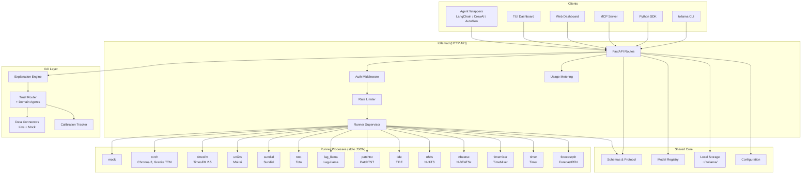
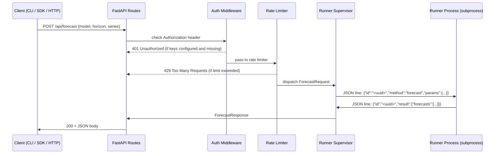

# Architecture

## Overview

tollama is a forecast decision trust layer — an evaluation, calibration, and
explanation engine for forecast-driven enterprise decisions. It uses a
worker-per-model-family architecture with an Ollama-compatible API surface
where the daemon manages HTTP routing and supervision while isolated runner
processes handle model inference.

## System Diagram



## Layer Responsibilities

| Layer | Directory | Responsibility |
|-------|-----------|----------------|
| **Daemon** | `src/tollama/daemon/` | HTTP API, auth, rate limiting, runner supervision |
| **Runners** | `src/tollama/runners/` | Model inference via stdio JSON protocol |
| **Core** | `src/tollama/core/` | Shared schemas, protocol, registry, storage, config |
| **CLI** | `src/tollama/cli/` | User-facing commands, daemon HTTP client |
| **Client** | `src/tollama/client/` | Shared HTTP client (CLI, MCP, SDK) |
| **MCP** | `src/tollama/mcp/` | MCP server and tool handlers |
| **SDK** | `src/tollama/sdk.py` | High-level Python API with workflow chaining |
| **Skills** | `src/tollama/skill/` | Agent framework wrappers |
| **XAI** | `src/tollama/xai/` | Explainability, trust scoring, decision policy, connectors |

## Key Boundaries

- **Daemon does not import ML runtimes.** Heavy dependencies belong in runner extras.
- **Runners do not expose HTTP.** Communication is stdio JSON lines only.
- **Core is the shared contract layer.** All request/response types live here.
- **Each runner family is independently installable** via optional extras
  (`runner_torch`, `runner_timesfm`, etc.).
- **XAI layer is post-inference.** It consumes forecast results and produces
  explanations, trust scores, and decision reports — it never touches model inference.

---

## Request Data Flow

What happens inside the daemon when a forecast request arrives:



The runner process is a **separate subprocess** — this is why the daemon can
stay free of heavy ML dependencies. Each runner family has its own optional extras
(`runner_torch`, `runner_timesfm`, etc.) and can run in an isolated venv.

---

## Stdio Line Protocol

Runners implement a simple newline-delimited JSON protocol over stdin/stdout.
The full spec lives in `src/tollama/core/protocol.py`.

**Request** (daemon → runner):
```json
{"id": "<uuid>", "method": "<method>", "params": {"key": "value"}}
```

**Success response** (runner → daemon):
```json
{"id": "<uuid>", "result": {"forecasts": [...]}}
```

**Error response** (runner → daemon):
```json
{"id": "<uuid>", "error": {"code": 4, "message": "model not loaded", "data": null}}
```

**Supported methods:**

| Method | Description |
|--------|-------------|
| `hello` | Initial handshake, runner announces itself |
| `capabilities` | Returns which models and features the runner supports |
| `load` | Load a model into memory |
| `unload` | Release a loaded model |
| `forecast` | Run inference and return forecast results |
| `ping` | Liveness probe |

**Implementing a new runner:** Spawn a process that reads JSON-line requests from
stdin and writes JSON-line responses to stdout, implementing the six methods above.
Use `tollama dev scaffold <family>` to generate the boilerplate.

---

## XAI Trust Agent Architecture

The XAI layer (`src/tollama/xai/`) provides explainability, trust scoring, and
decision policy evaluation for forecast-driven decisions. It operates entirely
post-inference.

### Components

| Component | Module | Purpose |
|-----------|--------|---------|
| Explanation Engine | `xai/engine.py` | Orchestrates all XAI sub-components into a unified explanation |
| Trust Router | `xai/trust_router.py` | Routes payloads to domain-specific trust agents, supports multi-agent aggregation |
| Trust Agents | `xai/trust_agents/` | Domain-specific trust scoring (heuristic + MCA) |
| Data Connectors | `xai/connectors/` | External data feed protocol with live HTTP and mock stub implementations |
| Calibration Tracker | `xai/trust_agents/calibration.py` | Learned weight adjustments from outcome feedback |
| Decision Policy | `xai/decision_policy.py` | Applies policy rules to trust-scored results |
| Forecast Decompose | `xai/forecast_decompose.py` | Trend/seasonal/residual decomposition |
| Feature Attribution | `xai/feature_attribution.py` | Temporal SHAP-style feature importance |
| Model Card | `xai/model_card.py` | EU AI Act model card generation |

### Trust Agent Domains

| Domain | Agent | Source Types | Key Metrics |
|--------|-------|-------------|-------------|
| `prediction_market` | MarketCalibrationTrustAgent | polymarket, metaculus, manifold | brier_score, log_loss, ECE |
| `financial_market` | FinancialMarketTrustAgent | financial, equity, derivatives | volatility, liquidity, data_freshness |
| `news` | NewsTrustAgent | news, media, social_media | source_credibility, corroboration, recency |
| `supply_chain` | SupplyChainTrustAgent | supply_chain, logistics, inventory | supplier_reliability, lead_time_variance, data_freshness |
| `geopolitical` | GeopoliticalTrustAgent | geopolitical, country_risk, sanctions | political_stability, sanctions_exposure, conflict_proximity |
| `regulatory` | RegulatoryTrustAgent | regulatory, compliance, legal | compliance_score, enforcement_risk, reporting_quality |

### Data Connector Protocol

Connectors implement the `DataConnector` runtime-checkable protocol to bridge
external data feeds into the trust pipeline. The `ConnectorRegistry` resolves
connectors by domain, and the `PayloadAssembler` converts connector output into
trust-router-ready payloads.

Both sync (`DataConnector`) and async (`AsyncDataConnector`) protocols are
supported. The `ConnectorRegistry` / `AsyncConnectorRegistry` resolve connectors
by domain, and the `PayloadAssembler` / `AsyncPayloadAssembler` convert connector
output into trust-router-ready payloads.

Available connectors:

| Connector | Domain | Type |
|-----------|--------|------|
| `MockFinancialConnector` | financial_market | Stub |
| `MockNewsConnector` | news | Stub |
| `MockSupplyChainConnector` | supply_chain | Stub |
| `MockGeopoliticalConnector` | geopolitical | Stub |
| `MockRegulatoryConnector` | regulatory | Stub |
| `HttpFinancialConnector` | financial_market | Live HTTP |
| `HttpNewsConnector` | news | Live HTTP |
| `HttpSupplyChainConnector` | supply_chain | Live HTTP |
| `HttpGeopoliticalConnector` | geopolitical | Live HTTP |
| `HttpRegulatoryConnector` | regulatory | Live HTTP |
| `AsyncHttpFinancialConnector` | financial_market | Async HTTP |
| `AsyncHttpNewsConnector` | news | Async HTTP |
| `AsyncHttpSupplyChainConnector` | supply_chain | Async HTTP |
| `AsyncHttpGeopoliticalConnector` | geopolitical | Async HTTP |
| `AsyncHttpRegulatoryConnector` | regulatory | Async HTTP |

### Calibration

The `CalibrationTracker` maintains a sliding window of prediction-outcome pairs
per agent. After accumulating enough observations (≥5), it computes per-component
weight adjustment factors in [0.5, 1.5] based on Pearson correlation with
prediction residuals. Trust agents can optionally consume these adjustments to
self-correct over time.

Calibration data is persisted to `~/.tollama/xai/calibration.json` using atomic
writes. The `TrustRouter` auto-loads calibration data on startup and auto-persists
every 10 analyze calls. Use `tollama xai calibration` to inspect calibration stats.

### CLI XAI Commands

The `tollama xai` subcommand group exposes XAI functionality from the CLI:

| Command | Description |
|---------|-------------|
| `tollama xai explain-decision --input <file>` | Run explanation engine on a forecast result |
| `tollama xai trust-score --input <file>` | Compute trust score breakdown |
| `tollama xai model-card --input <file>` | Generate EU AI Act model card |
| `tollama xai calibration [agent]` | Show calibration stats for trust agents |
