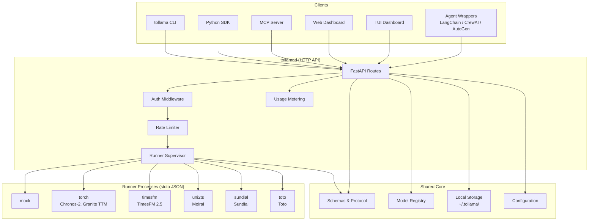
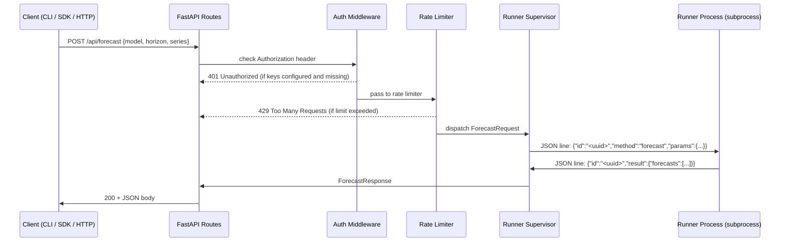

# Architecture

## Overview

tollama is a local-first time-series forecasting daemon with an Ollama-compatible
API surface. It uses a worker-per-model-family architecture where the daemon
manages HTTP routing and supervision while isolated runner processes handle
model inference.

## System Diagram



## Layer Responsibilities

| Layer | Directory | Responsibility |
|-------|-----------|----------------|
| **Daemon** | `src/tollama/daemon/` | HTTP API, auth, rate limiting, runner supervision |
| **Runners** | `src/tollama/runners/` | Model inference via stdio JSON protocol |
| **Core** | `src/tollama/core/` | Shared schemas, protocol, registry, storage, config |
| **CLI** | `src/tollama/cli/` | User-facing commands, daemon HTTP client |
| **Client** | `src/tollama/client/` | Shared HTTP client (CLI, MCP, SDK) |
| **MCP** | `src/tollama/mcp/` | MCP server and tool handlers |
| **SDK** | `src/tollama/sdk.py` | High-level Python API with workflow chaining |
| **Skills** | `src/tollama/skill/` | Agent framework wrappers |

## Key Boundaries

- **Daemon does not import ML runtimes.** Heavy dependencies belong in runner extras.
- **Runners do not expose HTTP.** Communication is stdio JSON lines only.
- **Core is the shared contract layer.** All request/response types live here.
- **Each runner family is independently installable** via optional extras
  (`runner_torch`, `runner_timesfm`, etc.).

---

## Request Data Flow

What happens inside the daemon when a forecast request arrives:



The runner process is a **separate subprocess** — this is why the daemon can
stay free of heavy ML dependencies. Each runner family has its own optional extras
(`runner_torch`, `runner_timesfm`, etc.) and can run in an isolated venv.

---

## Stdio Line Protocol

Runners implement a simple newline-delimited JSON protocol over stdin/stdout.
The full spec lives in `src/tollama/core/protocol.py`.

**Request** (daemon → runner):
```json
{"id": "<uuid>", "method": "<method>", "params": {"key": "value"}}
```

**Success response** (runner → daemon):
```json
{"id": "<uuid>", "result": {"forecasts": [...]}}
```

**Error response** (runner → daemon):
```json
{"id": "<uuid>", "error": {"code": 4, "message": "model not loaded", "data": null}}
```

**Supported methods:**

| Method | Description |
|--------|-------------|
| `hello` | Initial handshake, runner announces itself |
| `capabilities` | Returns which models and features the runner supports |
| `load` | Load a model into memory |
| `unload` | Release a loaded model |
| `forecast` | Run inference and return forecast results |
| `ping` | Liveness probe |

**Implementing a new runner:** Spawn a process that reads JSON-line requests from
stdin and writes JSON-line responses to stdout, implementing the six methods above.
Use `tollama dev scaffold <family>` to generate the boilerplate.
